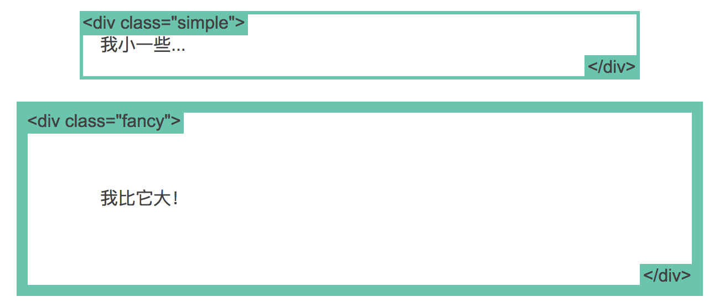

# 学习CSS布局

### 1、了解 `display` 属性:

**说明:**

display 是CSS中最重要的用于控制布局的属性。每个元素都有一个默认的 `display` 值，这与元素的类型有关。对于大多数元素它们的默认值通常是 `block` 或 `inline` 。

* #### block 

`div` 是一个标准的块级元素。一个块级元素会新开始一行并且尽可能撑满容器。其他常用的块级元素包括 `p` 、 `form` 和HTML5中的新元素： `header` 、 `footer` 、 `section` 等等。

* #### inline

span 是一个标准的行内元素。一个行内元素可以在段落中 `<span> 像这样 </span>` 包裹一些文字而不会打乱段落的布局。 a 元素是最常用的行内元素，它可以被用作链接。

* #### none

另一个常用的display值是 `none` 。一些特殊元素的默认 display 值是它，例如 `script` 。 `display:none` 通常被 JavaScript 用来在不删除元素的情况下隐藏或显示元素。

它和 `visibility` 属性不一样。把 display 设置成 `none` 元素不会占据它本来应该显示的空间，但是设置成 `visibility: hidden`; 还会占据空间。

* #### 其他 display 值

还有很多的更有意思的 display 值，例如 `list-item` 和 `table` 。[这里有一份详细的列表](https://developer.mozilla.org/en-US/docs/CSS/display)。之后会讨论到 `inline-block` 和 `flex` 。

* #### 其他

每个元素都有一个默认的 display 类型, 你可以随时随地的重写它！你可以把有特定语义的元素改成行内元素。常见的例子是：把 li 元素修改成 inline，制作成水平菜单。

---

### 2、使用 `margin: auto` 让元素居中显示:

**说明:**

设置块级元素的 `width` 可以防止它从左到右撑满整个容器。然后你就可以设置左右外边距为 auto 来使其水平居中。元素会占据你所指定的宽度，然后剩余的宽度会一分为二成为左右外边距。代码如下:
```
#main {
    width: 600px;
    margin: 0 auto; 
}
```
唯一的问题是，当浏览器窗口比元素的宽度还要窄时，浏览器会显示一个水平滚动条来容纳页面。让我们再来改进下这个方案:
```
#main {
    max-width: 600px;
    margin: 0 auto; 
}
```
在这种情况下使用 `max-width` 替代 `width` 可以使浏览器更好地处理小窗口的情况, 这点在移动设备上显得尤为重要！

顺便提下， 所有的主流浏览器包括IE7+在内都支持 `max-width` !

---

### 3、盒模型

**说明:**

当设置了元素的宽度，实际展现的元素却超出你的设置：是因为元素的边框和内边距会撑开元素。看下面的例子，两个相同宽度的元素显示的实际宽度却不一样。代码如下:
```
.simple {
    width: 500px;
    margin: 20px auto;
}

.fancy {
    width: 500px;
    margin: 20px auto;
    padding: 50px;
    border-width: 10px;
}
```
如下图所示:

<p align="left">
    
</p>


