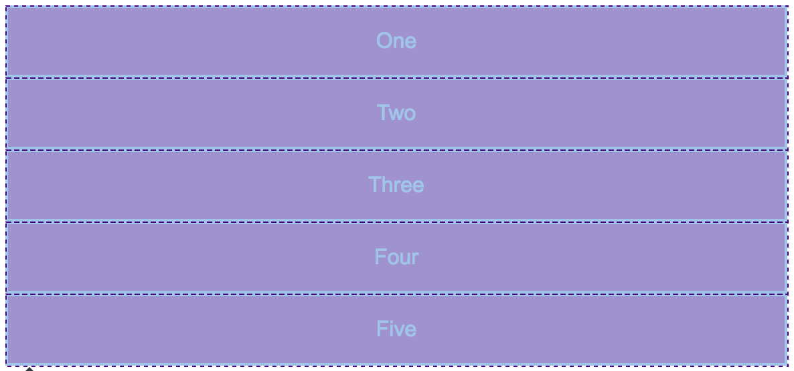
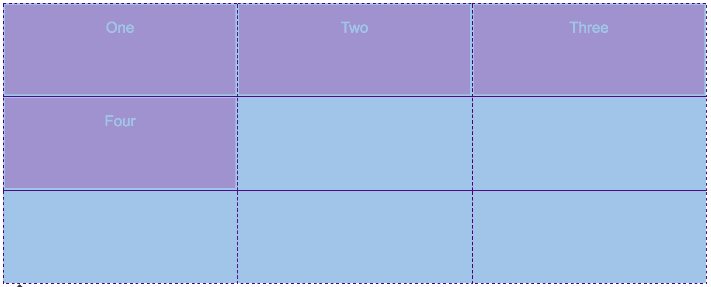
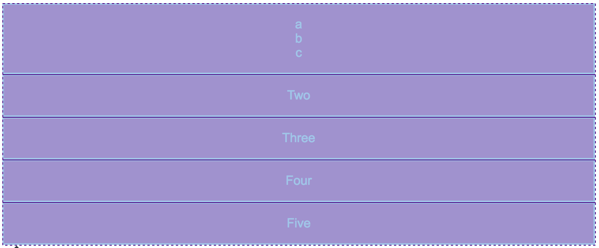

# CSS网格布局

- #### 什么是网格布局

网格仅仅是由水平和垂直线集合创建的一个模式，我们可以根据这个模式排列我们的设计元素。它们帮助我们创建设计——在页面之间移动时元素不会跳动或更改宽度，从而在我们的网站上提供高一致性。

网格通常具有**列（column）**，**行（row）**，以及在每行和列之间的间隙——通常称为**沟槽（gutter）**。如下图所示:

<p align="left">
    
</p>

```
注意：任何有设计背景的人似乎都感到惊讶，CSS没有内置的网格系统，而我们似乎使用各种次优方法来创建网格状的设计。正如你将在本文的
最后一部分中发现的那样，这将被改变，但是你可能需要知道在未来一段时间内创建网格的现有方法。
```

---

- #### 在项目中使用网格系统

为了确保整个网站或应用程序的一致性体验，从一开始就将其置于网格系统上，这意味着不需要考虑某个元素相对于其他元素的宽度。您的选择限于“该元素将跨越多少个网格列”。

您的“网格系统”可以简单地是在设计过程中使用常规网格所做的决策。

您的网格系统也可能是一个框架—— 无论是由第三方还是您为您自己的的项目创建的——通过CSS强制实现网格。

---

- #### 创建简单的网格框架

目前大多数网格类型布局是使用浮动创建的。

要创建的最简单的网格框架类型是固定宽度的 —— 我们只需要计算出想要设计的总宽度，想要多少列，以及沟槽和列的宽度。如果我们决定在具有列根据浏览器宽度增长和缩小的网格上布置设计，我们需要计算出列和沟槽之间的百分比宽度。

---

### 1、CSS Grid 使用

CSS Grid是一个强大的工具，它允许在Web上创建二维布局。

- ##### 网格容器

通过设置 `display` 属性设置属性值为 `grid` 或 `inline-grid` 可以创建一个网格容器。网格容器中的所有子元素就会自动变成网格项目（grid item）。
```    
    display: grid;
```
示例: [exp-1](exp-1.html)

在浏览器中，元素转为网格前看不出什么差异，因为网格给这些元素创建了一个单列网格。在开发工具中查看示例，元素上的网格会覆盖在浏览器窗口中。如下图所示：

<p align="left">
    
</p>

---

### 2、网格轨道

我们通过 `grid-template-columns` 和 `grid-template-rows` 属性来定义网格中的行和列。这些属性定义了网格的轨道。一个网格轨道就是网格中任意两条线之间的空间。
```
.wrapper {
    display: grid;
    grid-template-columns: 200px 200px 200px;
}
```

- ##### `fr` 单位

轨道可以使用任何长度单位进行定义。 

网格还引入了一个另外的长度单位来帮助我们创建灵活的网格轨道。新的 `fr` 单位代表网格容器中可用空间的一等份。

下面代码将创建三个相等宽度的轨道，这些轨道会随着可用空间增长和收缩:
```
.wrapper {
    display: grid;
    grid-template-columns: 1fr 1fr 1fr;
}
```
也可以混合了绝对尺寸的轨道与分数单位轨道,如下面代码所示:
```
.wrapper {
    display: grid;
    grid-template-columns: 500px 1fr 2fr;
}
```
第一个轨道是500像素，这个固定宽度被从可用空间中取走。剩下的空间被分为三份，按比例分配给了两个弹性尺寸轨道。

- ##### 在轨道清单中使用repeat()

有着多轨道的大型网格可使用 repeat() 标记来重复部分或整个轨道列表。如下方的定义:
```
.wrapper {
    display: grid;
    grid-template-columns: 1fr 1fr 1fr;
}  
```
也可以写成:
```
.wrapper {
    display: grid;
    grid-template-columns: repeat(3, 1fr);
}
```
**来看另一段代码:**
```
.wrapper {
    display: grid;
    grid-template-columns: 20px repeat(6, 1fr) 20px;
}
```
它起始轨道为20像素，接着重复了6个 1fr 的轨道，最后再添加了一个20像素的轨道。

**再来看一段代码:**
```css
.wrapper {
    display: grid;
    grid-template-columns: repeat(5, 1fr 2fr);
}
```
这个例子中，网格将有共计10个轨道，为1个1fr轨道后面跟着1个2fr轨道，该模式重复5次。

- ##### 轨道大小和minmax()

在设置一个显式的网格或者定义自动创建的行和列的大小的时候，我们也许想给网格一个最小的尺寸，确保他们能扩大到容纳他里面添加的内容。

网格用 `minmax()` 函数来解决这个问题。来看一个例子:
```css
.wrapper {
    display: grid;
    grid-template-columns: repeat(3, 1fr);
    grid-auto-rows: minmax(100px, auto);
}
```
这个例子中，自动创建的行高将会是最小100像素，最大为auto。用 `auto` 意味着行的尺寸将会根据内容的大小来自动变换：根据本行中最高的单元，把空间扩展到足够容纳该单元。

- ##### 间距

在两个网格单元之间的 网格横向间距  或 网格纵向间距  可使用 `grid-column-gap` 和 `grid-row-gap` 属性来创建，或者直接使用两个合并的缩写形式 `grid-gap`。来看一个例子：
```css
.wrapper {
     display: grid;
     grid-template-columns: repeat(3, 1fr);
     grid-column-gap: 10px;
     grid-row-gap: 1em;
}
```
这个例子创建一个横向间距为10px、纵向间距为1em的网格元素.

间距使用的空间会在 使用弹性长度fr的轨道的空间计算前就被留出来，间距的尺寸定义行为和普通轨道一致，但不同的是你不能向其中插入任何内容。从以基线定位的角度来说，间距就像一条很宽的基线。

**注意：** `grid-gap` 只能创建列与列或行与行之间的间距，但不能创建列和行与网格容器边缘的间距。

---

### 3、通过网格线来定位网格项目

示例：[exp-2](exp-2.html)

这个例子使用了3行3列的导轨，从而每个方向上有4条线。网格容器中有4个子元素，如果我们不定义它们的位置，它们会按照自动定位规则布局，即前4个单元格中各1个元素。如图所示：

<p align="left">
    
</p>

- ##### 通过线编号为网格元素进行定位

我们可以使用基于线的定位控制这些元素在网格上的位置。当你为某些元素定位，剩下的元素会继续按照自动定位规则定位。我们对示例一进行修改：
```css
.box1 {
     grid-column-start: 1;
     grid-column-end: 2;
     grid-row-start: 1;
     grid-row-end: 4;
}
.box2 {
     grid-column-start: 3;
     grid-column-end: 4;
     grid-row-start: 1;
     grid-row-end: 3;
}
.box3 {
     grid-column-start: 2;
     grid-column-end: 3;
     grid-row-start: 1;
     grid-row-end: 2;
}
.box4 {
     grid-column-start: 2;
     grid-column-end: 4;
     grid-row-start: 3;
     grid-row-end: 4;
}
```
最终效果如下：

<p align="left">
    
</p>

- ##### `grid-column` 和 `grid-row` 简写

`grid-column-start` 和 `grid-column-end` 属性可以合并为 `grid-column`，`grid-row-start` 和 `grid-row-end` 则合并为 `grid-row`。

通过修改代码，我们可以达到同样的效果：
```css
.box1 {
     grid-column: 1 / 2;
     grid-row: 1 / 4;
}
.box2 {
     grid-column: 3 / 4;
     grid-row: 1 / 3;
}
.box3 {
     grid-column: 2 / 3;
     grid-row: 1 /  2;
}
.box4 {
     grid-column: 2 / 4;
     grid-row: 3 / 4;
}
```

- ##### 默认跨度

实际上，元素默认延伸一个轨道，你可以省略 `grid-column-end` 或 `grid-row-end` 值。拿上面的例子进行修改，得到下面的代码：

```css
.box1 {
     grid-column-start: 1;
     grid-row-start: 1;
     grid-row-end: 4;
}
.box2 {
     grid-column-start: 3;
     grid-row-start: 1;
     grid-row-end: 3;
}
.box3 {
     grid-column-start: 2;
     grid-row-start: 1;
} 
.box4 {
     grid-column-start: 2;
     grid-column-end: 4;
     grid-row-start: 3;
}
```

结合 `grid-column` 和 `grid-row` 的简写，得到如下代码：

```css
.box1 {
     grid-column: 1 ;
     grid-row: 1 / 4;
}  
.box2 {
     grid-column: 3 ;
     grid-row: 1 / 3;
}
.box3 {
     grid-column: 2 ;
     grid-row: 1 ;
}
.box4 {
     grid-column: 2 / 4;
     grid-row: 3 ;
}
```

- ##### `grid-area` 属性

属性 grid-area。值的顺序如下：
```
1） grid-row-start
2） grid-column-start
3） grid-row-end
4） grid-column-end
```

- ##### 反向计数

比如：

```css
.box1 {
     grid-column-start: -1;
     grid-column-end: -2;
     grid-row-start: -1;
     grid-row-end: -4;
}
.box2 {
     grid-column-start: -3;
     grid-column-end: -4;
     grid-row-start: -1;
     grid-row-end: -3;
}
.box3 {
     grid-column-start: -2;
     grid-column-end: -3;
     grid-row-start: -1;
     grid-row-end: -2;
}
.box4 {
     grid-column-start: -2;
     grid-column-end: -4;
     grid-row-start: -3;
     grid-row-end: -4;
}
```

- ##### 使用 `span` 关键字

关键词 `span` 后面紧随数字，表示合并多少个列或行。

拿示例二进行修改，可以得到同样的效果：

```css
.box1 {
     grid-column: 1;
     grid-row: 1 / span 3;
} 
.box2 {
     grid-column: 3;
     grid-row: 1 / span 2;
}
.box3 {
     grid-column: 2;
     grid-row: 1;
}
.box4 {
     grid-column: 2 / span 2;
     grid-row: 3;
}
```

**注意：如果你没有给所有元素定位，那些没被定位的元素就会按照自动定位规则定位。同时，你明确定位的元素是可以互相重叠的。**

---

### 4、嵌套网格

一个网格元素可以也成为一个网格容器。

示例三：[exp-3.html](exp-3.html)，效果如下图：

<p align="left">
    
</p>

如果把 `box1` 设置成 `display: grid` 你可以给它定义轨道然后它也会变成一个网格元素，它的子级元素也会排列在这个新网格元素中。如下：

```css
.box1 {
     grid-column-start: 1;
     grid-column-end: 4;
     grid-row-start: 1;
     grid-row-end: 3;
     display: grid;
     grid-template-columns: repeat(3, 1fr);
}
```

最终效果如下图：

<p align="left">
    
</p>

在这个例子中，嵌套网格和他的父级并没有关系。就像你在例子中所看见的一样，它并没有从它的父级继承 `grid-gap` 属性，并且嵌套网格里面的网格线没有与父级的网格线对齐。

---

### 5、使用 `z-index` 控制层级

多个网格项目可以占用同一个网格单位。如果我们回到之前根据网格线编号放置网格项目的话，我们可以更改此项来使两个网格项目重叠。

示例四：[exp-4.html](exp-4.html)

先增加如下代码：

```css
.wrapper {
     display: grid;
     grid-template-columns: repeat(3, 1fr);
     grid-auto-rows: 100px;
}
.box1 {
     grid-column-start: 1;
     grid-column-end: 4;
     grid-row-start: 1;
     grid-row-end: 3;
}
.box2 {
     grid-column-start: 1;
     grid-row-start: 2;
     grid-row-end: 4;
}
```

效果如下：

<p align="left">
    
</p>

可以看到网格项目 `box2` 现在覆盖于 `box1` 之上，其覆盖顺序遵循文档流的原始顺序（后来居上）。

再将代码进行修改：

```css
.box1 {
     grid-column-start: 1;
     grid-column-end: 4;
     grid-row-start: 1;
     grid-row-end: 3;
     z-index: 2;
}
.box2 {
     grid-column-start: 1;
     grid-row-start: 2;
     grid-row-end: 4;
     z-index: 1;
}
```

效果如下：

<p align="left">
    
</p>

我们给 `box2` 设定一个低于 `box1` 的 `z-index` 值的话，`box2` 将会显示在 `box1` 的下方。

---

### 6、网格线命名

通过 `grid-template-rows` 和 `grid-template-columns` 定义网格时，网格线可以被命名。**网格线名称也可以设置网格项目位置。**

- ##### 给网格线命名：

```
    grid-template-rows: [row-1-start] 1fr [row-2-start] 1fr [row-2-end]; 
    grid-template-columns: [col-1-start] 1fr [col-2-start] 1fr [col-3-start] 1fr [col-3-end];
```

`grid-template-rows` 和 `grid-template-columns` 定义你的网格，将名称分配给网格线。定义网格线名称时需要避免使用规范中出现的关键词，以免导致混乱。

分配网格线名称必须用方括号 `[网格线名称]`，然后后面紧跟网格轨道的尺寸值。

来看一个例子：

```
    grid-template-rows: [row-start row-1-start] 1fr [row-1-end row-2-start] 1fr [row-2-end row-end]; 
    grid-template-columns: [col-start] 1fr [col-2-start] 1fr [col-3-start] 1fr [col-end];
```

效果如下图：

<p align="left">
    
</p>

- ##### 通过网格线名称设置网络项目位置

使用网格线名称设置网格项目位置和使用网格线号码设置网格项目位置类似。如下：

```
    grid-row-start:    row-2-start;
    grid-row-end:      row-end;
    grid-column-start: col-2-start;
    grid-column-end:   col-end;
```

---

### 7、网格区域命名

- ##### 给网格区域命名

像网格线名称一样，网格区域的名称也可以使用grid-template-areas属性来命名。引用网格区域名称也可以设置网格项目位置。

```
grid-template-areas: "header header" 
                     "content sidebar" 
                     "footer footer"; 
grid-template-rows: 150px 1fr 100px; 
grid-template-columns: 1fr 200px;
```

效果如下图：

<p align="left">
    
</p>

设置网格区域的名称应该放置在单引号或双引号内，每个名称由一个空格符分开。网格区域的名称，每组（单引号或双引号内的网格区域名称）定义了网格的一行，每个网格区域名称定义网格的一列。

### 8、网格项目对齐方式(Box Alignment)

参考资料：[网络布局中的盒模型](https://developer.mozilla.org/zh-CN/docs/Web/CSS/CSS_Grid_Layout/Box_Alignment_in_CSS_Grid_Layout)

`justify-items` 和 `justify-self` 指定网格项目沿着主轴对齐方式；`align-items` 和 `align-self` 指定网格项目沿着交叉轴对齐方式。设置了 `align-items` 属性，就相当于为网格的所有子项目都设置了 `align-self` 属性，当然也可以为单独的某一个网格元素设置它的个性化的 `align-self` 属性。

`justify-items` 和 `align-items` 应用在网格容器上，`align-self` 和 `justify-self` 属性用于网格项目自身对齐方式。它们的属性值相同：

```
   - auto
   - normal
   - start
   - end
   - center
   - stretch
   - baseline
   - first baseline
   - last baseline
```

`align-content` 指定网格轨道沿着交叉轴对齐方式；`justify-content` 指定网格轨道沿着主轴对齐方式。它的属性值如下
```
   - normal
   - start
   - end
   - center
   - stretch
   - space-around
   - space-between
   - space-evenly
   - baseline
   - first baseline
   - last baseline
```


